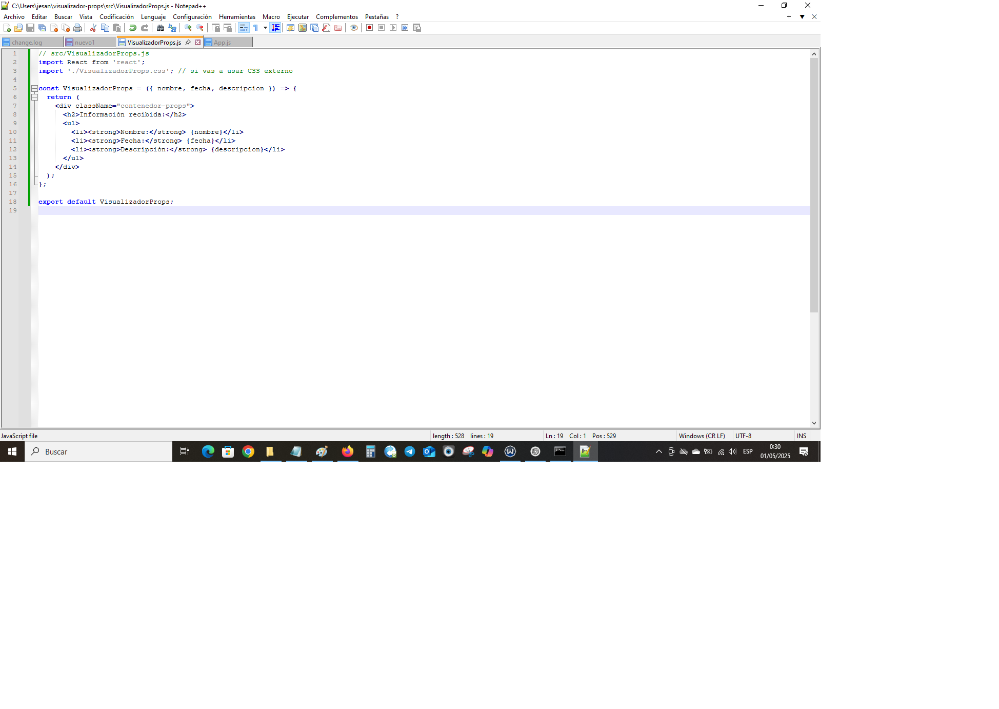
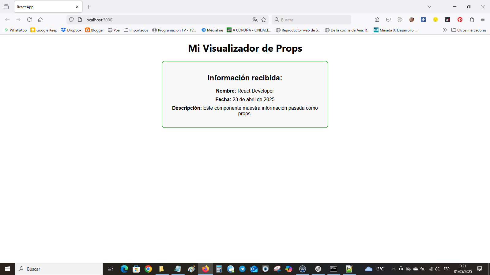
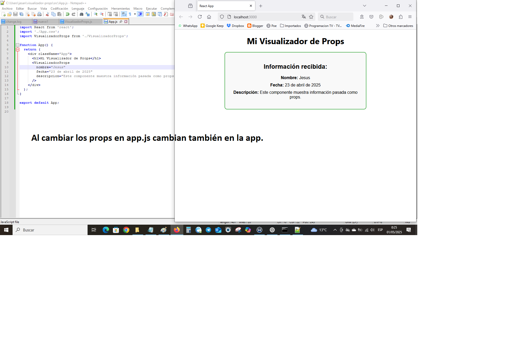

# Visualizador de Props en React

Este proyecto es un ejercicio básico de React que muestra cómo crear un componente funcional que recibe y muestra información utilizando **props**.

## 🧩 Descripción

El componente `VisualizadorProps` recibe datos a través de props (por ejemplo, `nombre`, `fecha`, `descripción`) y los muestra en pantalla de forma clara y estructurada. Es una forma simple pero efectiva de aprender el manejo de props en React y entender cómo se comunican los componentes.

## 📦 Estructura del proyecto

visualizador-props/ ├── public/ ├── src/ │ ├── App.js │ ├── VisualizadorProps.js │ ├── VisualizadorProps.css │ └── index.js ├── README.md └── package.json


## 🚀 ¿Cómo ejecutar este proyecto?

1. Clona el repositorio o descarga el código:
   ```bash
   git clone https://github.com/jesanre/visualizador-props.git
   cd visualizador-props

2. Instala las dependencias:
   ```bash
   npm install


3. Ejecuta el proyecto en modo desarrollo:
   ```bash
   npm start


El navegador se abrirá automáticamente en http://localhost:3000.

✨ Funcionalidades
Componente funcional con props.

Uso de desestructuración para acceder a los datos.

Estilos aplicados con CSS.

Visualización clara y responsiva de los datos.

🖼️ Capturas de pantalla

Visualización de datos con props
 




📚 Aprendizajes
Crear componentes funcionales en React.

Uso y manejo de props.

Aplicación de estilos básicos con CSS.

Organización del código en un proyecto React.

🛠️ Tecnologías utilizadas
React

JavaScript (ES6+)

CSS

📌 Autor
Hecho con 💻 por jesanre
https://github.com/jesanre


